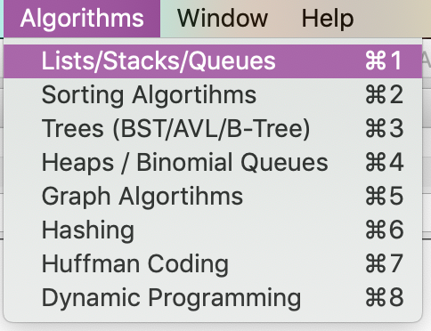
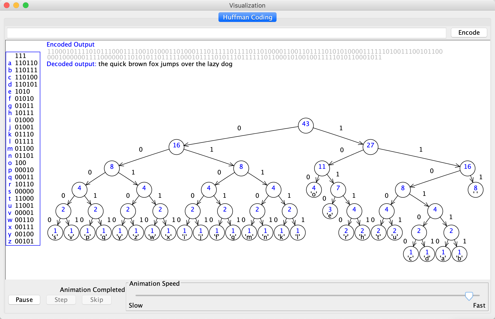

#可视化的常见算法演示

本项目为David Galles的项目，是 Swing 的可视化项目。
如： huffman 、AVL、RedBlackTree 等算法。

启动方式：Main-Class: edu.usfa.ds.DSApplication

refer: https://www.cs.usfca.edu/~galles/visualization/java/download.html

项目为学习所用，不得用于商业目的。

edit by jiek in beijing china.

鸣谢: David Galles